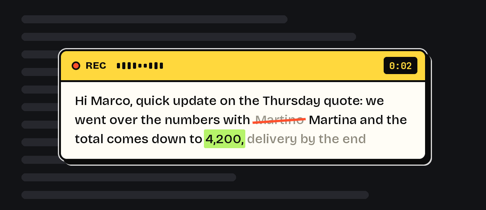
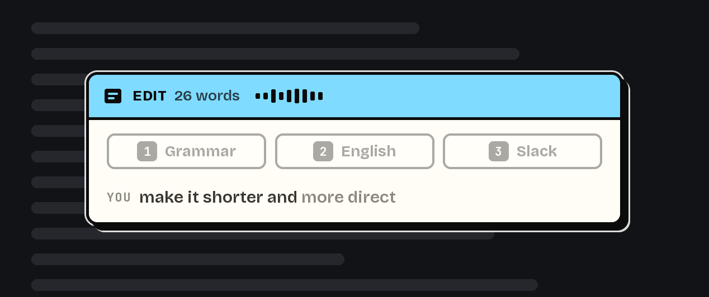
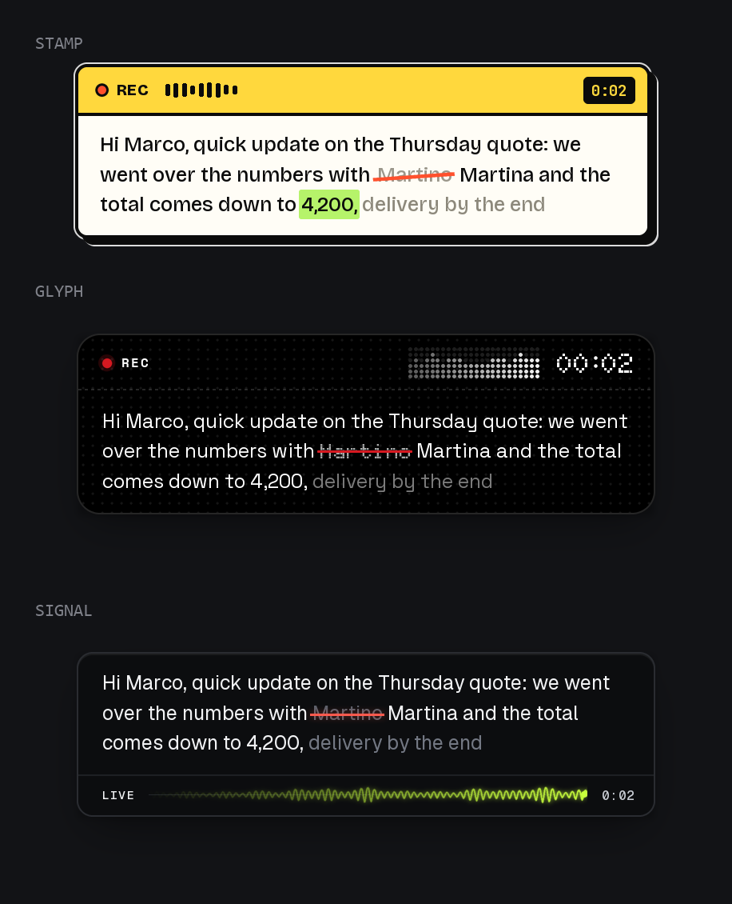

<p align="center">
  
</p>

<h1 align="center">Wavetype</h1>

<p align="center">
  <b>Press a hotkey, talk, and clean text lands where you were typing.</b><br>
  Voice dictation for Windows, in any app, with a live preview next to your caret.
</p>

<p align="center">
  
</p>

<p align="center">
  
  
  
  
</p>

---

You press **Win+Ctrl**, you talk, you press it again. The words are transcribed, stripped of
"um" and "you know", punctuated, turned into lists where you meant lists, and pasted into
whatever field had focus: your editor, a browser input, Slack, a terminal.

While you speak, a card next to the caret shows what the engine is hearing. Words it is still
unsure about are grey, fixed words go white, and anything it takes back gets struck through in
red for half a second before it disappears. The card never steals focus and never types into
the app underneath: the paste happens once, at the end. Edit Mode and Win+Ctrl+R recovery each
get their own version of the card; if the card or the preview engine behind it errors, dictation
carries on the same way and the text still arrives.

## What it does

### Dictate anywhere

Any app, any text field. Italian, English and Spanish with auto-detect. The text that lands is
already formatted, so you are not left cleaning up a transcript.

Start talking halfway through a line you already began and the words pick it up where you left
off, lowercase and spaced. Start on an empty field and you get a fresh capitalised sentence.
Names from your dictionary, acronyms and *I* keep their capital either way.

Talk for ten minutes and the whole take lands. A long dictation is split at sentence ends and the
pieces are cleaned side by side; if a piece comes back shorter than what you said, that piece is
pasted in your own words and two falling notes tell you, so what reaches the field is everything
you dictated.

### Edit what you already wrote

<p align="center">
  
</p>

Select some text, press the same hotkey, and say what you want done with it: *"make it shorter"*,
*"turn this into a list"*, *"translate it to English"*. The selection is replaced by the result.
Three common jobs sit on the card as numbered chips, so you can press **1**, **2** or **3**
instead of saying anything.

### Pick how it looks

<p align="center">
  
</p>

Three built-in looks. Put `stamp`, `glyph` or `signal` in a file called `card_style.txt` next to
`wavetype.py`.

## Install

You need **Python 3.11+** on Windows.

```bash
git clone https://github.com/LorenzoAlejandroMontes/wavetype.git
cd wavetype
python -m venv .venv
.\.venv\Scripts\pip install -r requirements.txt
```

Then get a **free Groq API key** from [console.groq.com](https://console.groq.com) → API Keys,
and save it in a file named `groq_key.txt` in the project folder:

```bash
copy groq_key.example.txt groq_key.txt
notepad groq_key.txt
```

The key is yours and stays on your machine. `groq_key.txt` is in `.gitignore`, so it is never
committed. There is no Wavetype server in between: your machine talks to Groq directly.

Start it with a double click on **`Wavetype.vbs`** (runs with no console window), or:

```bash
.\.venv\Scripts\pythonw wavetype.py
```

### Running without a key, fully offline

Leave `groq_key.txt` out and Wavetype uses the local engine instead: [faster-whisper](https://github.com/SYSTRAN/faster-whisper)
for speech and [Ollama](https://ollama.com) for the clean-up pass (`ollama pull qwen2.5:7b`).
Slower, and nothing leaves the machine.

## Shortcuts

Every command is a chord on **Win+Ctrl**. Press and release, nothing to hold down.

| Key | What happens |
|---|---|
| **Win + Ctrl** | Start recording. Press again to stop: the text is formatted and pasted |
| **Win + Ctrl** *(with text selected)* | Opens **Edit Mode** on that selection instead of dictating |
| **Win + Ctrl + R** | Re-run the last recording and paste it again |
| **Win + Ctrl + T** | Cycle the card style: `stamp` → `glyph` → `signal` |
| **Win + Ctrl + Q** | Quit |
| **Esc** | Cancel, at any stage |
| **1** / **2** / **3** | Edit Mode only: run that chip immediately, without speaking |

### While you are recording

- **There is no pause key, and you do not need one.** Stop talking and after 3 seconds the card
  switches to `PAUSED` on its own. The mic stays open, nothing is lost, and the moment you speak
  again it goes back to `LIVE`. The card tells you the way out while paused: Win+Ctrl to insert,
  Esc to throw it away.
- **Esc always wins.** During recording it drops the take. During transcription or formatting it
  stops that too, and nothing is pasted. The card shows `CANCELLED` for half a second so you know
  it took.
- **Every 5 minutes** of an open mic, a double beep reminds you it is still recording.
- **Length is not a limit.** Long takes are split on natural pauses, transcribed in pieces and
  stitched back together.

### Edit Mode in detail

Select text anywhere, press **Win+Ctrl**, and the card opens with the word count and three chips:

| Chip | Key | What it does |
|---|---|---|
| **Grammar** | `1` | Fixes grammar, spelling, punctuation and phrasing, and makes it read more naturally. Keeps the language, the meaning, the tone, the names, and every piece of information: nothing added, nothing dropped |
| **English** | `2` | Translates to English, the way a native speaker would write it |
| **Slack** | `3` | Rewrites it as a work chat message: colleague tone, direct, short paragraphs. No invented greetings, no emoji |

Press the number and it runs at once, without you saying anything, and the key never reaches the
app underneath. Or just say what you want in your own words: *"make it shorter"*, *"turn this into
bullets"*, *"translate to Spanish"*. Either way, the selection is replaced with the result.

If nothing was selected, Edit Mode does not open and you get a plain dictation instead.

## Engines

| | Speech to text | Clean-up and edits |
|---|---|---|
| **Groq** (with a key) | `whisper-large-v3-turbo` | `openai/gpt-oss-120b` |
| **Local** (no key) | faster-whisper | Ollama, `qwen2.5:7b` |

With a Groq key your **audio is uploaded to Groq** for transcription, and the transcript is sent
for formatting. Without a key, both steps run on your machine. Groq's free tier has a daily token
budget; when it runs out Wavetype falls back to the local engine rather than failing.

## When something goes wrong

Every take is written to `recordings/` **before** it is sent anywhere, and kept for 7 days. If the
network drops, if Groq times out, or if you hit Esc by mistake, press **Win+Ctrl+R** and the audio
is transcribed again and pasted into the active window. The card next to the caret shows how long
the recording is while it works, then shows the text that comes back — or, if nothing does, what
to do next (the audio stays in the archive either way). Calls are retried three times on their own,
waiting as long as the API asks when it is rate limited.

Long takes get a second look. Speech models can lose the thread on a long stretch of continuous
speech: punctuation stops and short accented words come back clipped. Wavetype spots that pattern
— a long run with no punctuation that also has clipped words in it — and transcribes the audio
again in 60-second pieces, keeping whichever of the two reads better. On a 435-second take that
turned two runs of 69 and 157 words into clean sentences, at the cost of 23 seconds instead of 10,
on the 1.4% of dictations where it triggers.

## Custom vocabulary

Put one name or bit of jargon per line in `vocab.txt` next to `wavetype.py`. It is passed to both
the transcription and the formatting pass, so proper nouns come out spelled the way you spell them.
That file is gitignored.

## How it works

- `wavetype.py` — the orchestrator: hotkeys, recording, transcription, formatting, paste. tkinter
  UI on the main thread, a worker thread for everything slow, so the card never freezes.
- `live_engine.py` / `live_local.py` / `live_dual.py` — the live preview engines (Groq, local, and
  the one that runs both and picks).
- `live_panel.py` + `card_styles.py` — the card: layout, the three styles, every phase.
- `edit_chips.py` — Edit Mode chips and the instructions behind them.
- `caret.py` — finds the caret so the card knows where to sit.
- `context.py` — reads what sits before the caret so the dictation continues your sentence.

## Tests

```bash
.\.venv\Scripts\python tests\test_wavetype_live.py
.\.venv\Scripts\python tests\test_live_engine.py
.\.venv\Scripts\python tests\test_live_dual.py
.\.venv\Scripts\python tests\test_live_local.py
.\.venv\Scripts\python tests\test_panel_styles.py
.\.venv\Scripts\python tests\test_edit_card.py
.\.venv\Scripts\python tests\test_context.py
.\.venv\Scripts\python tests\test_derail.py
```

Each file prints `n/n ok` and exits non-zero on failure. The ones that need a Groq key skip
themselves when there isn't one.

## Contributing

Issues and pull requests are welcome, in English or Italian. See [CONTRIBUTING.md](CONTRIBUTING.md).
Code comments are in Italian: that is the author's language, and translating them is a fine first
pull request.

## License

MIT. See [LICENSE](LICENSE).

## Credits

Inspired by [freeflow](https://github.com/zachlatta/freeflow), the macOS equivalent.
Fonts in `assets/fonts/` ship under the SIL Open Font License, see `assets/fonts/OFL.txt`.
